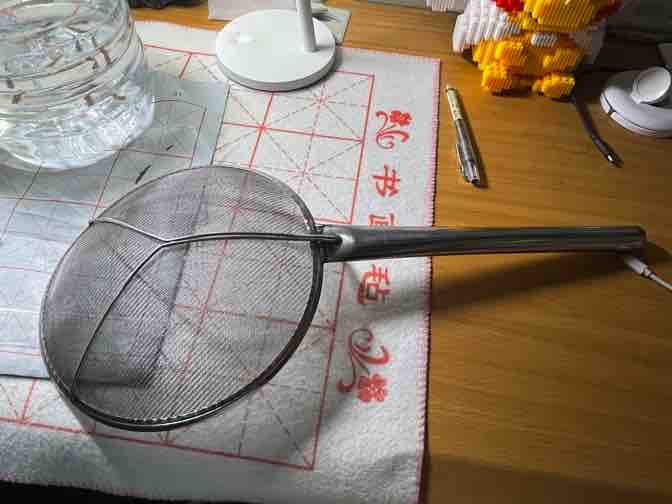
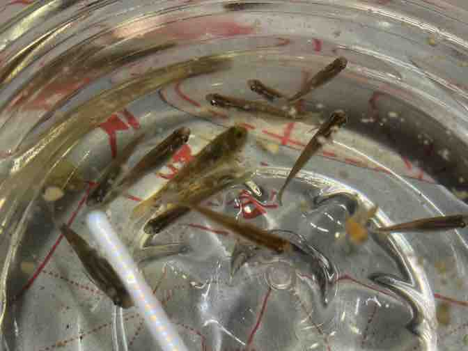

## 时间：

2022年04月28日

## 天气：

有雨，阴天，晚上有点冷🌧️

## 记录者：

王海洋

## 地点：

综合楼

## 活动：

上午我又起晚了，睡觉了，谭涵月也睡觉了，两人都没有起床。

中午吃了个饭，谭涵月吃到了她最喜欢吃的辣子鸡，很开心。🐔

下午咱一起学习，她背单词。谭涵月听到了噩耗，英语竞赛因为疫情取消了，这么多天的辛勤付出泡汤了。😭

我设计完了数字电路时钟电路仿真图，收获满满。

晚上谭涵月点了一份炸鸡，我俩取炸鸡的时候，惊心动魄，生怕保安把我们的炸鸡给没收，好不不容拿到了炸鸡，在篮球场旁边的小椅子上开心的吃起来。谭涵月点了榴莲味的蘸料，我吃起来很好吃（被逼无奈😅被迫营业）

吃完炸鸡以后，遛弯的时候，捡到了一个大漏勺🕸，上面写着“小高”二字，我们俩拿走以后，萌生出了捞鱼的想法，于是就到了学位湖里捞起了小鱼。一个人拿着手机打灯，一个人撅着屁股捞鱼。不一会儿，就捞了很多，有大的有小的。

捞完鱼以后，我把鱼带回了宿舍，问舍友要了一个大桶，把大桶剪成了两半，我在饮水机上给小鱼接了7毛钱的水，还给他们喂了饼干，鱼儿在里面欢快的游着，我兴奋的口水不禁流了出来🤣。

